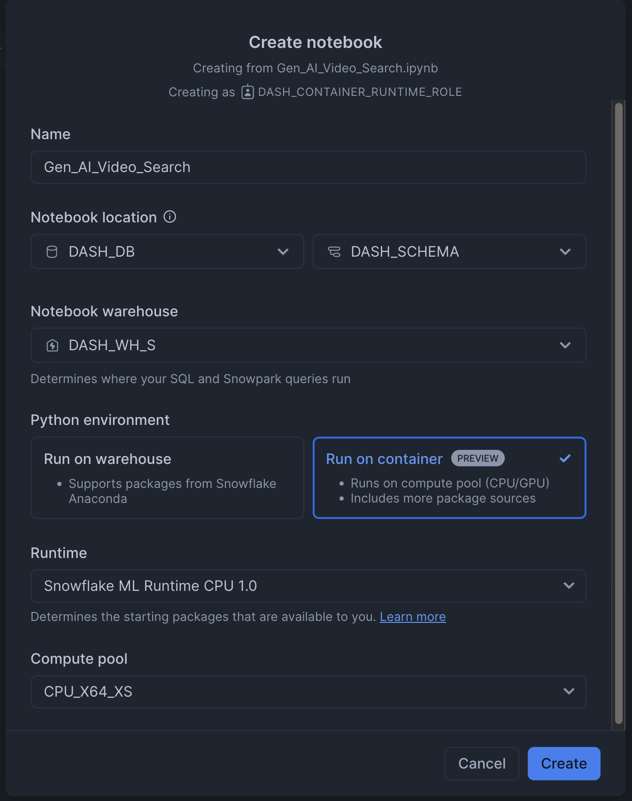
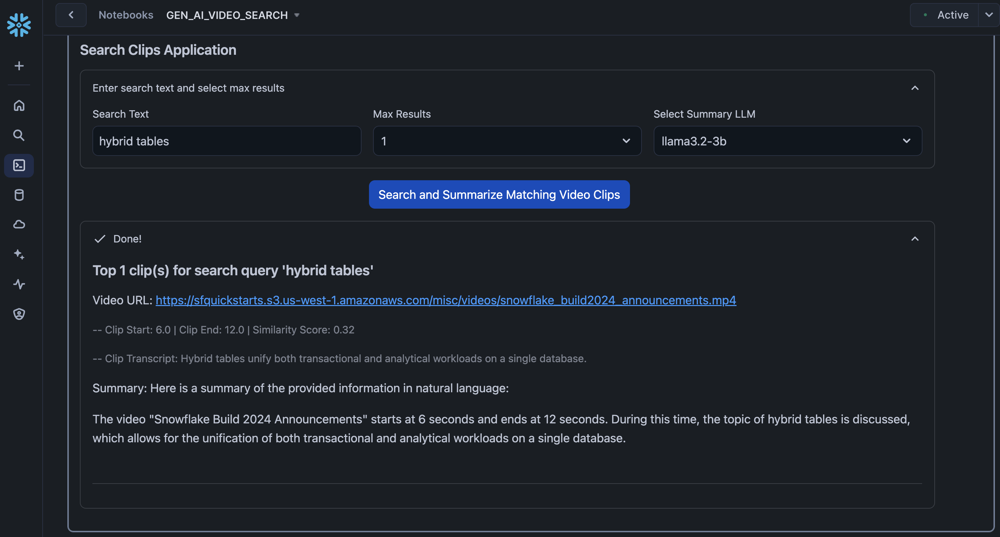

id: ai-video-search-with-snowflake-and-twelveLabs
summary: Getting Started with Data Engineering and ML using Snowpark for Python and Snowflake Notebooks
categories: featured,getting-started,data-science-&-ml,data-engineering,app-development
environments: web
status: Published
feedback link: <https://github.com/Snowflake-Labs/sfguides/issues>
tags: Getting Started, Snowpark Python, Streamlit, Data-Science-&-Ai, Featured
authors: Dash Desai

# AI Video Search with Snowflake and TwelveLabs
<!-- ------------------------ -->

## Overview

Duration: 5

This guide outlines the process for creating a video search and summarization workflow in Snowflake Notebook on Container Runtime. Videos stored in an S3 bucket are processed to generate embeddings using the Twelve Labs API, with parallelization achieved through a Snowpark Python User Defined Table Function (UDTF). These embeddings are stored in a Snowflake table using the VECTOR datatype, enabling efficient similarity searches with VECTOR_COSINE_SIMILARITY. Text queries are converted into embeddings using the same API to find the top N matching video clips. Audio from these clips is extracted using MoviePy and transcribed with Whisper. Finally, Cortex Complete is used to summarize the results, including video details, timestamps, and transcripts.

### What is Container Runtime? 

Snowflake Notebooks on Container Runtime enable advanced data science and machine learning workflows directly within Snowflake. Powered by Snowpark Container Services, it provides a flexible environment to build and operationalize various workloads, especially those requiring Python packages from multiple sources and powerful compute resources, including CPUs and GPUs. With this Snowflake-native experience, you can train models, perform hyperparameter tuning, and execute batch inference while seamlessly running SQL queries. Unlike virtual warehouses, Container Runtime for ML offers greater flexibility and tailored compute options for complex workloads. ***NOTE: This feature is currently in Public Preview.***

Learn more about [Container Runtime](https://docs.snowflake.com/en/user-guide/ui-snowsight/notebooks-on-spcs).

### What is Twelve Labs? 

Twelve Labs is a platform that provides AI-powered video understanding tools. It enables developers to extract meaningful insights from video content by creating embeddings that represent visual and audio features, allowing for advanced search, categorization, and analysis. With APIs for generating embeddings and querying them for similarity, Twelve Labs is ideal for tasks like content-based retrieval, scene detection, and semantic search in videos. It integrates seamlessly into workflows, making it easier to process and analyze large-scale video data efficiently.

Learn more about [Snowflake Cortex](https://docs.snowflake.com/en/user-guide/snowflake-cortex/overview).

### What is Snowflake Cortex? 

Snowflake Cortex is an intelligent, fully managed service that offers machine learning and AI solutions to Snowflake users. Snowflake Cortex capabilities include:

LLM Functions: SQL and Python functions that leverage large language models (LLMs) for understanding, querying, translating, summarizing, and generating free-form text.

ML Functions: SQL functions that perform predictive analysis such as forecasting and anomaly detection using machine learning to help you gain insights into your structured data and accelerate everyday analytics.

Learn more about [Snowflake Cortex](https://docs.snowflake.com/en/user-guide/snowflake-cortex/overview).

## What is Whisper? 

OpenAI’s Whisper is an open-source automatic speech recognition (ASR) model designed for high-quality transcription and translation of spoken language. Trained on diverse multilingual data, it handles various languages, accents, and challenging audio conditions like background noise. Whisper supports transcription, language detection, and translation to English, making it versatile for applications such as subtitles, accessibility tools, and voice interfaces. Available in multiple model sizes, it balances performance and resource needs, enabling seamless integration into real-world projects.

Learn more about [Whisper](https://openai.com/index/whisper/).

### Prerequisites

* Access to a [Snowflake account](https://signup.snowflake.com/) with ACCOUNTADMIN role.
* Access to a [Twelve Labs account and API key](https://api.twelvelabs.io).
* Access to video(s) uploaded to a publicly accessible URL. *NOTE: In this demo the videos have been uploaded to AWS S3.*

## What You Will Learn

* **Generate Video Embeddings**: Use the Twelve Labs API to create embeddings for videos stored in an S3 bucket.
* **Parallel Processing**: Leverage a Python UDTF to process the videos in parallel.
* **Store Embeddings**: Save the video embeddings in a Snowflake table using the VECTOR datatype.
* **Similarity Search**: Use VECTOR_COSINE_SIMILARITY to find the top *N* matching clips for a given text query. The query is converted into embeddings via the Twelve Labs API.
* **Transcription**: Use MoviePy to extract audio from the top *N* video clips, then transcribe them with Whisper.
* **Summarize Results**: Utilize Cortex Complete to summarize results, including video name/URL, clip start and end times (in seconds), and the transcript of each clip.

### What You Will Build

An interactive Snowflake Notebook on Container Runtime running in Snowflake.

<!-- ------------------------ -->
## Setup

Duration: 10 

Step 1. In Snowsight, [create a SQL Worksheet](https://quickstarts.snowflake.com/guide/build_genai_inpainting_and_hybridtable_app_in_snowpark_container_services/index.html?index=..%2F..index#1:~:text=create%20a%20SQL%20Worksheet) and open [setup.sql](https://github.com/Snowflake-Labs/sfguide-ai-video-search-with-snowflake-and-twelveLabs/blob/main/setup.sql) to execute all statements in order from top to bottom.

Step 2. In Snowsight, switch your user role to `DASH_CONTAINER_RUNTIME_ROLE`.

Step 3. Click on [Gen_AI_Video_Search.ipynb](https://github.com/Snowflake-Labs/sfguide-ai-video-search-with-snowflake-and-twelveLabs/blob/main/Gen_AI_Video_Search.ipynb) to download the Notebook from GitHub. (NOTE: Do NOT right-click to download.)

Step 4. In Snowsight:

* On the left hand navigation menu, click on **Projects » Notebooks**
* On the top right, click on **Notebook** down arrow and select **Import .ipynb file** from the dropdown menu
* Select **Gen_AI_Video_Search.ipynb** file you downloaded in the step above
* In the Create Notebook popup
    * For Notebook location, select `DASH_DB` and `DASH_SCHEMA`
    * For SQL warehouse, select `DASH_WH_S`
    * For Python environment, select `Run on container`
    * For Runtime, select `Snowflake ML Runtime CPU 1.0`
    * For Compute pool, select `CPU_X64_XS`
    * Click on **Create** button

<!--  -->

Step 5. Open Notebook

* Click in the three dots at the very top-right corner and select `Notebook settings` >> `External access`
* Turn on **ALLOW_ALL_ACCESS_INTEGRATION**
* Click on **Save** button
* Click on **Start** button on top right

NOTE: At this point, the container service will take about 5-7 minutes to start. You will not be able to proceed unless the status changes from **Starting** to **Active**.

<!-- ------------------------ -->
## Run Notebook

Duration: 15

* Cell 1: Install libraries

* Cell 2: Import liraries

* Cell 3: Videos list. This is where we provide a list of publicly accessible URLs.

* Cell 4: Create and register `create_video_embeddings` Snowpark Python User Defined Table Function (UDTF) for creating embeddings for the videos using Twelve Labs

* Cell 5: Create a Snowpark DataFrame using the list of videos and for each video call `create_video_embeddings` UDTF to generate embeddings. Note that the parallel processing of each video is achieved by `.over(partition_by="url")`. Then, save those embeddings in a Snowflake table called `video_embeddings`

* Cell 6: Download open source `whisper` model and define Python functions:
    * download_video_from_s3
    * extract_audio_from_video
    * transcribe_with_whisper
    * transcribe_video
    * transcribe_video_clip

* Cell 7: Replace `tlk_XXXXXXXXXXXXXXXXXX` with your Twelve Labs API Key. Here we define Python function `similarity_scores` that uses Twelve Labs to create embeddings for a given text -- *entered_text* passed in as a parameter. Then, similarity scores are generated using Snowflake function **VECTOR_COSINE_SIMILARITY** between text embeddings and video embeddings stored in `video_embeddings` table. This function returns top *N* records (based on *max_results* passed in as a parameter) with columns VIDEO_URL, START_OFFSET_SEC, END_OFFSET_SEC, and SIMILARITY_SCORE

* Cell 8: Streamlit application that takes search text, max results, and an LLM as input. Then, it first calls `similarity_scores` function to get top *N* video clip records along with their similarity scores. For each clip, it then calls `transcribe_video_clip` function passing in its VIDEO_URL, START_OFFSET_SEC, END_OFFSET_SEC to generate the clip transcription. Finally, it calls `snowflake.cortex.Complete` to summarize the output.

### Search Example

For example, if you were to enter "hybrid tables" and left everything else to the default values, you should see the following.

Where;

* It displays the URL fo the video, the clip start and end times, similarity score generated by VECTOR_COSINE_SIMILARITY, clip transcript generated by open source whisper model, as well as the summary generated by Snowflake Cortex.

<!-- ------------------------ -->
## Conclusion And Resources

Duration: 1

Congratulations! You've successfully created a multimodal AI videos processing app using Twelve Labs, Whisper, and Snowflake Cortex in Snowflake Notebook on Container Runtime. 

### What You Learned

* Generate Video Embeddings: Use the Twelve Labs API to create embeddings for videos stored in an S3 bucket.
* Parallel Processing: Leverage a Python UDTF to process the videos in parallel.
* Store Embeddings: Save the video embeddings in a Snowflake table using the VECTOR datatype.
* Similarity Search: Use VECTOR_COSINE_SIMILARITY to find the top *N* matching clips for a given text query. The query is converted into embeddings via the Twelve Labs API.
* Transcription: Use MoviePy to extract audio from the top *N* video clips, then transcribe them with Whisper.
* Summarize Results: Utilize Cortex Complete to summarize results, including video name/URL, clip start and end times (in seconds), and the transcript of each clip.

### Related Resources

- [GitHub Repo](https://github.com/Snowflake-Labs/sfguide-ai-video-search-with-snowflake-and-twelveLabs)
- [Snowflake Notebooks on Container Runtime](https://docs.snowflake.com/en/user-guide/ui-snowsight/notebooks-on-spcs)

